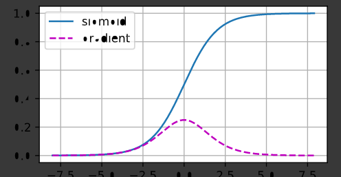

# Deep Learning #
## Steps
- createing a **fully-connected** neural network architecture
- apply neural nets to two classic ML problems: **regression** and **classification**
- train neural nets with **stochastic gradient descent**, and
- improve performance of network with **dropout**, **batch normalization** 


# What is Deep Learning? #

 **Deep learning** is an approach to machine learning characterized by deep stacks of computations.
 
* This depth of computation is what has enabled deep learning models to disentangle the kinds of complex and hierarchical patterns found in the most challenging real-world datasets.

 **Neural networks** are composed of neurons, where each neuron individually performs only a simple computation. 
 
 The `power` of a neural network comes  from the complexity of the connections these neurons form.

# The Linear Unit #

 the individual neuron. As a diagram, a **neuron** (or **unit**) with one input looks like:

<figure style="padding: 1em;">

<figcaption style="textalign: center; font-style: italic"><center>The Linear Unit: y = wx + b
</center></figcaption>
</figure>

* The input is `x`. Its connection to the neuron has a **weight** which is `w`. 

* The `b` is a special kind of weight we call the **bias**. 

* The `y` is the value the neuron ultimately outputs.

* This neuron's activation is `y = w * x + b`, or as a formula $y = w x + b$.


# Multiple Inputs #

>Rather than single Input there might have multipleinputs.For these
We can just add more input connections to the neuron, one for each additional feature.
<figure style="padding: 1em;">

<figcaption style="textalign: center; font-style: italic"><center>A linear unit with three inputs.
</center></figcaption>
</figure>

The formula for this neuron would be $y = w_0 x_0 + w_1 x_1 + w_2 x_2 + b$. A linear unit with two inputs will fit a plane, and a unit with more inputs than that will fit a hyperplane.


# Creating multiple units #

The easiest way to create a model in Keras is through `keras.Sequential`, which creates a neural network as a stack of *layers*. We can create models like those above using a *dense* layer 

**SYNTAX:**
>**model = keras.Sequential([layers.Dense(units(`output units`)=1,input_shape=[3](`Input items`))])**

# Complex Networks #

The key idea here is `modularity`, building up a complex network from simpler functional units.

 We've seen how a linear unit computes a linear function -- now we'll see how to combine and modify these single units to model more complex relationships.

# Layers #

Neural networks typically organize their neurons into **layers**. When we collect together linear units having a common set of inputs we get a **dense** layer.

<figure style="padding: 1em ;">

<figcaption style="textalign: center; font-style: italic"><center>A dense layer of two linear units receiving two inputs and a bias.
</center></figcaption>
</figure>

You could think of each layer in a neural network as performing some kind of relatively simple transformation. 

Through a deep stack of layers, a neural network can transform its inputs in more and more complex ways.

 In a well-trained neural network, each layer is a transformation getting us a little bit closer to a solution.


<strong>Many Kinds of Layers</strong><br>

 A "layer" in Keras is a very general kind of thing. 
 A layer can be, essentially, any kind of <em>data transformation</em>.

 Many layers, like the <a href="https://www.tensorflow.org/api_docs/python/tf/keras/layers/Conv2D">convolutional</a> and <a href="https://www.tensorflow.org/api_docs/python/tf/keras/layers/RNN">recurrent</a> layers, transform data through use of neurons and differ primarily in the pattern of connections they form.
 
  Others though are used for <a href="https://www.tensorflow.org/api_docs/python/tf/keras/layers/Embedding">feature engineering</a> or just <a href="https://www.tensorflow.org/api_docs/python/tf/keras/layers/Add">simple arithmetic</a>.
  
   There's a whole world of layers to discover -- <a href="https://www.tensorflow.org/api_docs/python/tf/keras/layers">check them out</a>!


# The Activation Function #


 Two dense layers with nothing in between are no better than a single dense layer by itself. 
 
 Dense layers by themselves can never move us out of the world of lines and planes.

  What we need is something *nonlinear*,These are activation functions.

<figure style="padding: 1em;">


- **Without activation functions, neural networks can only learn linear relationships.**

- **In order to fit curves, we'll need to use activation functions.** 


An **activation function** is simply some function we apply to each of a layer's outputs (its *activations*). The most common is the *rectifier* function $max(0, x)$.

<figure style="padding: 1em;">


>**The rectifier function has a graph that's a line with the negative part "rectified" to zero. Applying the function to the outputs of a neuron will put a *bend* in the data, moving us away from simple lines.**


When we attach the rectifier to a linear unit, we get a **rectified linear unit** or **ReLU**

Applying a ReLU activation to a linear unit means the output becomes `max(0, w * x + b)`, which we might draw in a diagram like:
<figure style="padding: 1em;">


# Stacking Dense Layers #

<figure style="padding: 1em;">

<figcaption style="textalign: center; font-style: italic"><center>A stack of dense layers makes a "fully-connected" network.
</center></figcaption>
</figure>

**The layers before the output layer are  called **hidden** since we never see their outputs directly.**

**Now, notice that the final (output) layer is a linear unit (meaning, no activation function).**

**That makes this network appropriate to a regression task, where we are trying to predict some arbitrary numeric value.**

**Other tasks (like classification) might require an activation function on the output.**

## **Building Sequential Models** ##

The `Sequential` model we've been using will connect together a list of layers in order from first to last: the first layer gets the input, the last layer produces the output. This creates the model in the figure above

**In addition to the training data, we need two more things:**
- A "loss function" that measures how good the network's predictions are.
- An "optimizer" that can tell the network how to change its weights.

# The Loss Function #

The **loss function** measures the disparity between the the target's true value and the value the model predicts. 

Different problems call for different loss functions. 
- For **regression** problems,  the task is to predict some numerical value 

- A common loss function for regression problems is the **mean absolute error** or **MAE**. 

- For each prediction `y_pred`, MAE measures the disparity from the true target `y_true` by an absolute difference `abs(y_true - y_pred)`.


# The Optimizer - Stochastic Gradient Descent #

 The **optimizer** is an algorithm that adjusts the weights to minimize the loss.

The optimization algorithms used in deep learning belong to a family called **stochastic gradient descent**. They are iterative algorithms that train a network in steps. One **step** of training goes like this:
1. Sample some training data and run it through the network to make predictions.
2. Measure the loss between the predictions and the true values.
3. Finally, adjust the weights in a direction that makes the loss smaller.

Then just do this over and over until the loss is as small as you like (or until it won't decrease any further.)
<figure style="padding: 1em;">

<figcaption style="textalign: center; font-style: italic"><center>Training a neural network with Stochastic Gradient Descent.
</center></figcaption>
</figure>


Each iteration's sample of training data is called a **minibatch** (or often just "batch"), while a complete round of the training data is called an **epoch** . 
The number of epochs you train for is how many times the network will see each training example.

## Learning Rate and Batch Size ##

Notice that the line only makes a small shift in the direction of each batch (instead of moving all the way). The size of these shifts is determined by the **learning rate**. A smaller learning rate means the network needs to see more minibatches before its weights converge to their best values.

The learning rate and the size of the minibatches are the two parameters that have the largest effect on how the SGD training proceeds. Their interaction is often subtle and the right choice for these parameters isn't always obvious. (We'll explore these effects in the exercise.)

Fortunately, for most work it won't be necessary to do an extensive hyperparameter search to get satisfactory results. **Adam** is an SGD algorithm that has an adaptive learning rate that makes it suitable for most problems without any parameter tuning (it is "self tuning", in a sense).

d Adam is a great general-purpose optimizer.

## Adding the Loss and Optimizer ##

After defining a model, you can add a loss function and optimizer with the model's `compile` method:

```
model.compile(
    optimizer="adam",
    loss="mae",
)
```

# Forward Propagation, Backward Propagation, and Computational Graphs


- In training models with minibatch stochastic gradient descent  the calculations involved in *forward propagation* through the model are very computational.

- Hence,When it came time to calculate the gradients, the backpropagation function provided by the deep learning framework is very efficient.

- The automatic calculation of gradients (automatic differentiation)  simplifies the  implementation.


**In this section,  *backward propagation*
(more commonly called *backpropagation*) is explained.**


## Forward Propagation

>*Forward propagation*  means the calculation and storage of intermediate variables (including outputs) for a neural network in order from the input layer to the output layer.

 *This is tedious than **Backpropoagation**,but we will look into its implementation.*


 The input is ---> $\mathbf{x}\in \mathbb{R}^d$


Here the intermediate variable is:

$$\mathbf{z}= \mathbf{W}^{(1)} \mathbf{x} +\mathbf{B}$$

Here,

 **weight** : $\mathbf{W}^{(1)} \in \mathbb{R}^{h \times d}$


**NOTE**: Let us assume bias is zero for simplicity.

After running the intermediate variable
$\mathbf{z}\in \mathbb{R}^h$ through the
activation function $\phi$
we obtain our hidden activation vector of length $h$,

$$\mathbf{h}= \phi (\mathbf{z}).$$

The hidden variable $\mathbf{h}$
is also an intermediate variable.
Assuming that the parameters of the output layer
only possess a weight of
$\mathbf{W}^{(2)} \in \mathbb{R}^{q \times h}$,
we can obtain an output layer variable
with a vector of length $q$:

$$\mathbf{o}= \mathbf{W}^{(2)} \mathbf{h}.$$

Assuming that the loss function is $l$
and the example label is $y$,
we can then calculate the loss term
for a single data example,

$$L = l(\mathbf{o}, y).$$

According to the definition of $L_2$ regularization,
given the hyperparameter $\lambda$,
the regularization term is

$$s = \frac{\lambda}{2} \left(\|\mathbf{W}^{(1)}\|_F^2 + \|\mathbf{W}^{(2)}\|_F^2\right),$$


> the Frobenius norm of the matrix
is simply the $L_2$ norm applied
after flattening the matrix into a vector.

Finally, the model's regularized loss
on a given data example is:

$$J = L + s.$$

We refer to $J$ as the *objective function*
in the following discussion.


## Computational Graph of Forward Propagation


`

## Backpropagation

> *`Backpropagation`* is the method of calculating
the gradient of neural network parameters.

* this method traverses the network in reverse order:

                     output  ----->  input layer


`It follows` *`chain rule`*  `from calculus.`


- The algorithm stores any intermediate variables(partial derivatives)required while calculating the gradient with respect to some parameters.


## method
Let us take:
1. $\mathsf{Y}=f(\mathsf{X})$
and $\mathsf{Z}=g(\mathsf{Y})$

2. The input and the output $\mathsf{X}, \mathsf{Y}, \mathsf{Z}$ are tensors of arbitrary shapes.

3. By using the chain rule,
we can compute the derivative
of $\mathsf{Z}$ with respect to $\mathsf{X}$ via

$$\frac{\partial \mathsf{Z}}{\partial \mathsf{X}} = \text{prod}\left(\frac{\partial \mathsf{Z}}{\partial \mathsf{Y}}, \frac{\partial \mathsf{Y}}{\partial \mathsf{X}}\right).$$

Here,
- The $\text{prod}$ operator is used to multiply its arguments after the necessary operations,
such as transposition and swapping input positions,
have been carried out.


- For vectors, this is straightforward:
it is simply matrix-matrix multiplication.
For higher dimensional tensors,
we use the appropriate counterpart.
The operator $\text{prod}$ hides all the notation overhead.


- the parameters of the simple network with one hidden layer, whose computational graph is given above
are $\mathbf{W}^{(1)}$ and $\mathbf{W}^{(2)}$.

- The objective of backpropagation is to
calculate the gradients $\partial J/\partial \mathbf{W}^{(1)}$ and $\partial J/\partial \mathbf{W}^{(2)}$.

- We apply the chain rule and calculate, in turn, the gradient of each intermediate variable and parameter.


 - The order of calculations are reversed
relative to those performed in forward propagation.

## **STEPS**
----
## With Respect to $\mathbf{W}^{(1)}$
1. Calculate the gradients of the objective function $J=L+s$ with respect to the loss term $L$ and the regularization term $s$.

$$\frac{\partial J}{\partial L} = 1 \; \text{and} \; \frac{\partial J}{\partial s} = 1.$$

2. Compute the gradient of the objective function
with respect to variable of the output layer $\mathbf{o}$
according to the chain rule:

$$
\frac{\partial J}{\partial \mathbf{o}}
= \text{prod}\left(\frac{\partial J}{\partial L}, \frac{\partial L}{\partial \mathbf{o}}\right)
= \frac{\partial L}{\partial \mathbf{o}}
\in \mathbb{R}^q.
$$
3. Calculate the gradients of the regularization term with respect to both parameters:

$$\frac{\partial s}{\partial \mathbf{W}^{(1)}} = \lambda \mathbf{W}^{(1)}
\; \text{and} \;
\frac{\partial s}{\partial \mathbf{W}^{(2)}} = \lambda \mathbf{W}^{(2)}.$$
---
**Now we are able to calculate the gradient
$\partial J/\partial \mathbf{W}^{(2)} \in \mathbb{R}^{q \times h}$
of the model parameters closest to the output layer.
Using the chain rule yields:**

$$\frac{\partial J}{\partial \mathbf{W}^{(2)}}= \text{prod}\left(\frac{\partial J}{\partial \mathbf{o}}, \frac{\partial \mathbf{o}}{\partial \mathbf{W}^{(2)}}\right) + \text{prod}\left(\frac{\partial J}{\partial s}, \frac{\partial s}{\partial \mathbf{W}^{(2)}}\right)= \frac{\partial J}{\partial \mathbf{o}} \mathbf{h}^\top + \lambda \mathbf{W}^{(2)}.$$
---
## with respect to $\mathbf{W}^{(1)}$
To obtain the gradient with respect to $\mathbf{W}^{(1)}$
we need to continue backpropagation
along the output layer to the hidden layer.
The gradient with respect to the hidden layer's outputs
$\partial J/\partial \mathbf{h} \in \mathbb{R}^h$ is given by


$$
\frac{\partial J}{\partial \mathbf{h}}
= \text{prod}\left(\frac{\partial J}{\partial \mathbf{o}}, \frac{\partial \mathbf{o}}{\partial \mathbf{h}}\right)
= {\mathbf{W}^{(2)}}^\top \frac{\partial J}{\partial \mathbf{o}}.
$$

Since the activation function $\phi$ applies elementwise,
calculating the gradient $\partial J/\partial \mathbf{z} \in \mathbb{R}^h$
of the intermediate variable $\mathbf{z}$
requires that we use the elementwise multiplication operator,
which we denote by $\odot$:

$$
\frac{\partial J}{\partial \mathbf{z}}
= \text{prod}\left(\frac{\partial J}{\partial \mathbf{h}}, \frac{\partial \mathbf{h}}{\partial \mathbf{z}}\right)
= \frac{\partial J}{\partial \mathbf{h}} \odot \phi'\left(\mathbf{z}\right).
$$

Finally, we can obtain the gradient
$\partial J/\partial \mathbf{W}^{(1)} \in \mathbb{R}^{h \times d}$
of the model parameters closest to the input layer.
According to the chain rule, we get

$$
\frac{\partial J}{\partial \mathbf{W}^{(1)}}
= \text{prod}\left(\frac{\partial J}{\partial \mathbf{z}}, \frac{\partial \mathbf{z}}{\partial \mathbf{W}^{(1)}}\right) + \text{prod}\left(\frac{\partial J}{\partial s}, \frac{\partial s}{\partial \mathbf{W}^{(1)}}\right)
= \frac{\partial J}{\partial \mathbf{z}} \mathbf{x}^\top + \lambda \mathbf{W}^{(1)}.
$$

---

## Training Neural Networks

`When training neural networks,
forward and backward propagation depend on each other.`

* In particular, for forward propagation,
we traverse the computational graph in the direction of dependencies
and compute all the variables on its path.

* These are then used for backpropagation
where the compute order on the graph is reversed.


On one hand,
- computing during forward propagation
depends on the current values of model parameters $\mathbf{W}^{(1)}$ and $\mathbf{W}^{(2)}$.


- They are given by the optimization algorithm according to backpropagation in the latest iteration.


On the other hand,
- the gradient calculation during backpropagation
depends on the current value of the hidden variable $\mathbf{h}$, which is given by forward propagation.


> Therefore we should alternate forward propagation with backpropagation,
updating model parameters using gradients given by backpropagation.

> `Note`

>* backpropagation reuses the stored intermediate values from forward propagation to avoid duplicate calculations.

>* One of the consequences is that we need to retain
the intermediate values until backpropagation is complete.

>* This is also one of the reasons why training
requires significantly more memory than plain prediction.

>* training deeper networks using larger batch sizes
more easily leads to *out of memory* errors.
----
# Initialisation Of parameters #

> **The choice of initialization scheme plays a significant role in neural network learning, and it can be crucial for maintaining numerical stability**

* The Initialisation Of parameters is tied up with the choice of the nonlinear activation function.

- Which function we choose and how we initialize parameters
can determine how quickly our optimization algorithm converges.


## Vanishing and Exploding Gradients

> **Poor choices in initalisation can cause us to encounter exploding or vanishing gradients while training.**

Considering a deep network with $L$ layers, input $\mathbf{x}$ and output $\mathbf{o}$.
With each layer $l$ defined by a transformation $f_l$ parameterized by weights $\mathbf{W}^{(l)}$, whose hidden variable is $\mathbf{h}^{(l)}$ (let $\mathbf{h}^{(0)} = \mathbf{x}$), our network can be expressed as:

$$\mathbf{h}^{(l)} = f_l (\mathbf{h}^{(l-1)}) \text{ and thus } \mathbf{o} = f_L \circ \ldots \circ f_1(\mathbf{x}).$$

If all the hidden variables and the input are vectors,
we can write the gradient of $\mathbf{o}$ with respect to
any set of parameters $\mathbf{W}^{(l)}$ as follows:

$$\partial_{\mathbf{W}^{(l)}} \mathbf{o} = \underbrace{\partial_{\mathbf{h}^{(L-1)}} \mathbf{h}^{(L)}}_{ \mathbf{M}^{(L)} \stackrel{\mathrm{def}}{=}} \cdot \ldots \cdot \underbrace{\partial_{\mathbf{h}^{(l)}} \mathbf{h}^{(l+1)}}_{ \mathbf{M}^{(l+1)} \stackrel{\mathrm{def}}{=}} \underbrace{\partial_{\mathbf{W}^{(l)}} \mathbf{h}^{(l)}}_{ \mathbf{v}^{(l)} \stackrel{\mathrm{def}}{=}}.$$

This gradient is the product of $L-l$ matrices
$\mathbf{M}^{(L)} \cdot \ldots \cdot \mathbf{M}^{(l+1)}$ and the gradient vector $\mathbf{v}^{(l)}$.


- Thus it leads to numerical underflow that often crop up when multiplying together too many probabilities.


- Gradients of unpredictable magnitude threaten the stability of our optimization algorithms.

**We may be facing parameter updates that are either**
1.  excessively large, destroying our model(*`exploding gradient`*)

2. excessively small (*`vanishing gradient`*),rendering learning impossible as parameters hardly move on each update.

  

 WE can see,**the sigmoid's gradient vanishes both when its inputs are large and when they are small**

- Hence,`ReLUs`, which are more stable (but less neurally plausible),have emerged as the default choice for practitioners.

## Parameter Initialization

> One way of addressing---or at least mitigating---the
issues raised above is through careful initialization.


### Default Initialization

 
> **We use a normal distribution to initialize the values of our weights.**


### Xavier Initialization

> * For each layer, variance of any output is not affected by the number of inputs, and variance of any gradient is not affected by the number of outputs.

# Environment and Distribution Shift

Too often, machine learning developers develop models
without  considering  these fundamental issues.

1. **Where data come from in the first place**
2. **What we plan to ultimately do with the outputs from our models.**

`These things leads to failures in ML deployments.`

- These make our model very biased and dangerous
- We mustdetect these situations early to mitigate damage
----
* In many cases training and test sets do not come from the same distribution. This is called distribution shift.
* The risk is the expectation of the loss over the entire population of data drawn from their true distribution. However, this entire population is usually unavailable. Empirical risk is an average loss over the training data to approximate the risk. In practice, we perform empirical risk minimization.
* Under the corresponding assumptions, covariate and label shift can be detected and corrected for at test time. Failure to account for this bias can become problematic at test time.
* In some cases, the environment may remember automated actions and respond in surprising ways. We must account for this possibility when building models and continue to monitor live systems, open to the possibility that our models and the environment will become entangled in unanticipated ways.
----


## MINIMISING ERRORS


>Some of the solutions are simple
     asking for the "`right`" data

>some are technically difficult
like,implementing a `reinforcement learning system`.

### **Covariate Shift**


We assume that while the distribution of inputs
may change over time, the labeling function, i.e., the conditional distribution $P(y \mid \mathbf{x})$ does not change.


>Covariate shift is the natural assumption to invoke in settings
where we believe that $\mathbf{x}$ causes $y$.


